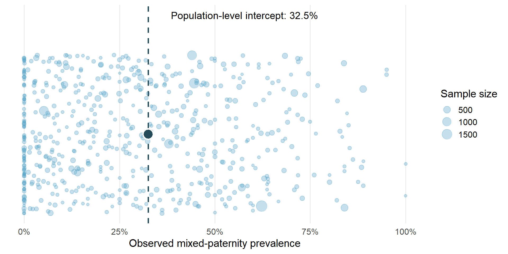
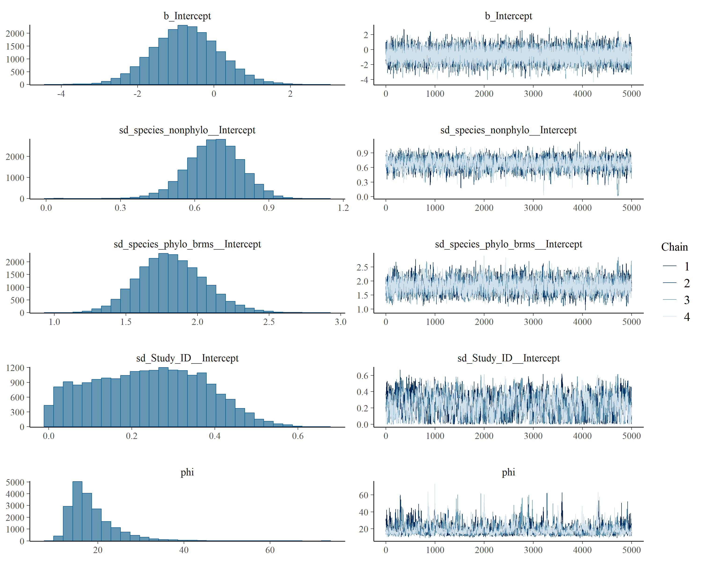

::: section-card
## Overall model

This section presents the intercept-only beta-binomial phylogenetic model used to estimate the population-level intercept and quantify heterogeneity in mixed-paternity prevalence across birds. The model accounts for study identity, non-phylogenetic species-level variation, and phylogenetically structured species-level variation.
:::

## Packages

The R packages required for model fitting and diagnostics.

```{r}
#| message: false
#| warning: false

library(tidyverse)
library(brms)
library(posterior)
library(bayesplot)
library(loo)

options(mc.cores = parallel::detectCores())
```

## Load prepared objects

```{r}
#| message: false
#| warning: false

data_overall_study <- readRDS("data/data_overall_study.rds")
phylo_mat <- readRDS("data/phylo_mat.rds")
```

## Overall dataset

```{r}
#| echo: false
#| message: false
#| warning: false

overall_data_summary <- data_overall_study %>%
  summarise(
    Observations = n(),
    Studies = n_distinct(Study_ID),
    Species = n_distinct(species_phylo_brms),
    `Total broods` = sum(n_total_broods, na.rm = TRUE),
    `Mixed-paternity broods` = sum(n_mixed_broods, na.rm = TRUE),
    `Raw prevalence (%)` = 100 * `Mixed-paternity broods` / `Total broods`
  )

knitr::kable(overall_data_summary, digits = 2)
```

## Modelling framework

Because brood-level paternity data are expected to exhibit substantial extra-binomial heterogeneity across references, populations, and species, we modelled mixed-paternity prevalence using beta-binomial generalised linear mixed-effects models with a logit link:

$$y_i \sim \mathrm{BetaBinomial}(n_i, \mu_i, \phi)$$

where $y_i$ is the number of broods with mixed paternity, $n_i$ is the total number of broods genotyped, $\mu_i$ is the expected mixed-paternity prevalence, and the precision parameter $\phi$ describes extra-binomial variation among study units.

The linear predictor was modelled as:

$$\mathrm{logit}(\mu_i) = \alpha + \mathbf{X}_i \boldsymbol{\beta} + u_{\mathrm{reference}[i]} + u_{\mathrm{species}[i]} + u_{\mathrm{phylo}[i]}$$

where $\alpha$ is the intercept, $\mathbf{X}_i \boldsymbol{\beta}$ represents fixed biological and methodological moderators, and $u_{\mathrm{reference}}$, $u_{\mathrm{species}}$, and $u_{\mathrm{phylo}}$ represent reference-level, non-phylogenetic species-level, and phylogenetically structured random effects, respectively.

## Population-level intercept prevalence

### Model

The intercept-only model estimated the population-level intercept while quantifying study-level, non-phylogenetic species-level, and phylogenetically structured species-level variation. Its inverse-logit transformation is the expected prevalence when all random effects are set to zero; it is not a marginal average across the observed studies or species.

```{r}
#| eval: false
#| echo: true

model_overall_study <- brm(
  n_mixed_broods | trials(n_total_broods) ~
    1 +
    (1 | Study_ID) +
    (1 | species_nonphylo) +
    (1 | gr(species_phylo_brms, cov = phylo_mat)),
  family = beta_binomial(link = "logit"),
  data = data_overall_study,
  data2 = list(phylo_mat = phylo_mat),
  chains = 4,
  cores = 4,
  iter = 10000,
  warmup = 5000,
  control = list(adapt_delta = 0.99, max_treedepth = 15),
  seed = 123
)

```

### Figure

```{r}

```

### Model sumamry

```{r}
#| message: false 
#| warning: false 

model_overall_study <- readRDS("models/model_overall_study.rds")
summary(model_overall_study)
```

### Model estimates

```{r}
#| echo: false
#| message: false
#| warning: false

s <- summary(model_overall_study)

model_summary_table <- tibble::tibble(
  Parameter = c(
    "Intercept (logit scale)",
    "Population-level intercept prevalence (%)",
    "Study-level SD",
    "Non-phylogenetic species-level SD",
    "Phylogenetic species-level SD",
    "Beta-binomial precision (phi)"
  ),
  Estimate = c(
    s$fixed["Intercept", "Estimate"],
    plogis(s$fixed["Intercept", "Estimate"]) * 100,
    s$random$Study_ID[1, "Estimate"],
    s$random$species_nonphylo[1, "Estimate"],
    s$random$species_phylo_brms[1, "Estimate"],
    s$spec_pars["phi", "Estimate"]
  ),
  `Lower 95% CrI` = c(
    s$fixed["Intercept", "l-95% CI"],
    plogis(s$fixed["Intercept", "l-95% CI"]) * 100,
    s$random$Study_ID[1, "l-95% CI"],
    s$random$species_nonphylo[1, "l-95% CI"],
    s$random$species_phylo_brms[1, "l-95% CI"],
    s$spec_pars["phi", "l-95% CI"]
  ),
  `Upper 95% CrI` = c(
    s$fixed["Intercept", "u-95% CI"],
    plogis(s$fixed["Intercept", "u-95% CI"]) * 100,
    s$random$Study_ID[1, "u-95% CI"],
    s$random$species_nonphylo[1, "u-95% CI"],
    s$random$species_phylo_brms[1, "u-95% CI"],
    s$spec_pars["phi", "u-95% CI"]
  )
)

knitr::kable(model_summary_table, digits = 3)
```

```{}
```

### Phylogenetic signal

We quantified the phylogenetic signal in between-species variation as the proportion of species-level variance attributable to the phylogenetically structured random effect:

$$
\nu =
\frac{\sigma^2_{\mathrm{phylo}}}
{\sigma^2_{\mathrm{phylo}} + \sigma^2_{\mathrm{nonphylo}}}
$$

where $\sigma^2_{\mathrm{phylo}}$ is the variance of the phylogenetically structured species-level random effect and $\sigma^2_{\mathrm{nonphylo}}$ is the variance of the non-phylogenetic species-level random effect.

The table below summarises the relative contribution of the phylogenetic and non-phylogenetic species-level variance components in the overall model.

```{r}
#| label: phylogenetic-signal-table
#| echo: false
#| message: false
#| warning: false

library(dplyr)
library(tidybayes)

draws_phylo_signal <- model_overall_study %>%
  spread_draws(
    sd_species_phylo_brms__Intercept,
    sd_species_nonphylo__Intercept
  ) %>%
  mutate(
    phylo_signal = sd_species_phylo_brms__Intercept^2 /
      (sd_species_phylo_brms__Intercept^2 + sd_species_nonphylo__Intercept^2)
  )

phylo_signal_summary <- draws_phylo_signal %>%
  summarise(
    Statistic = "Phylogenetic signal (ν)",
    Estimate = mean(phylo_signal),
    `Lower 95% CrI` = quantile(phylo_signal, 0.025),
    `Upper 95% CrI` = quantile(phylo_signal, 0.975)
  )

knitr::kable(
  phylo_signal_summary, 
  digits = 3, 
  caption = "Posterior mean estimate of the phylogenetic signal with a 95% equal-tailed credible interval."
)
```

## Diagnostics

### Posterior predictive checks

```{r}
pp_check(model_overall_study)
```

### Divergences

```{r}
#| echo: false
#| message: false
#| warning: false

divergence_table <- nuts_params(model_overall_study) |>
  filter(Parameter == "divergent__") |>
  count(Value) |>
  mutate(
    Value = ifelse(Value == 0, "Non-divergent", "Divergent")
  )

knitr::kable(divergence_table)
```

### Traceplots

```{r}
#| label: save-overall-traceplot
#| echo: false
#| message: false
#| warning: false
#| fig-width: 10
#| fig-height: 8

dir.create("Figures/model_diagnostics", recursive = TRUE, showWarnings = FALSE)

png(
  filename = "Figures/model_diagnostics/model_overall_traceplots.png",
  width = 3000,
  height = 2400,
  res = 300
)

plot(model_overall_study)

dev.off()
```

```{r}

#| label: show-overall-traceplot
#| echo: false
#| out-width: "100%"


```
