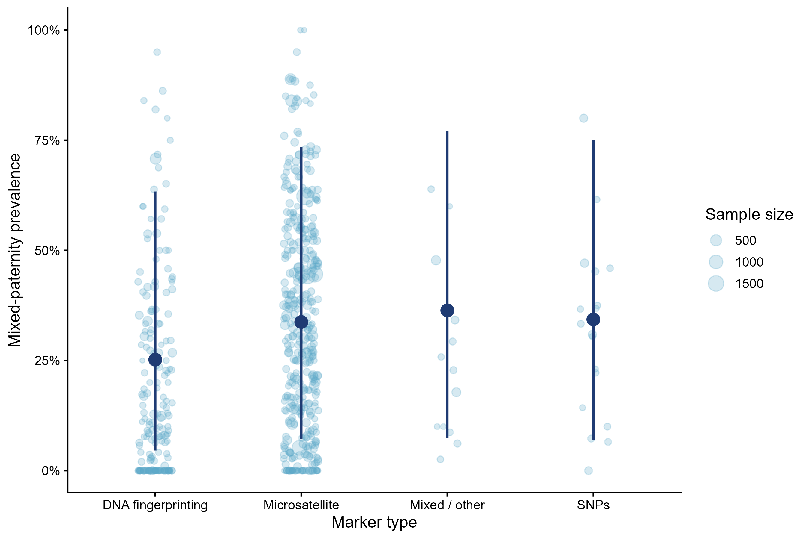
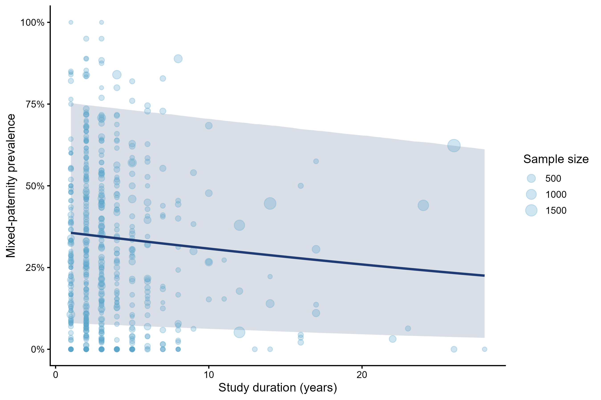
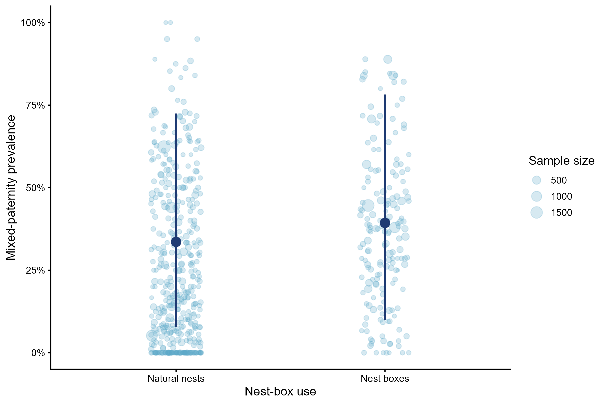

---
format:
  html:
    toc: true
    toc-depth: 3
---

::: section-card
## **Methodological moderators**

This section presents methodological moderators that may influence estimates of mixed-paternity prevalence across studies. We focus on marker type, nest-box use, nest type, and study duration, because these variables can affect both the detection and reporting of mixed paternity. All models use the same multilevel phylogenetic beta-binomial structure as the overall model.
:::

## Packages

The R packages required for model fitting.

```{r}
#| label: setup
#| message: false
#| warning: false
#| code-fold: true

library(tidyverse)
library(brms)
library(posterior)
library(bayesplot)
library(loo)
library(emmeans)

options(mc.cores = parallel::detectCores())
```

## Load prepared objects

```{r}

#| message: false
#| warning: false

data_overall_study <- readRDS("data/data_overall_study.rds")
phylo_mat <- readRDS("data/phylo_mat.rds")
```

```{r}
data_marker_type <- readRDS("data/data_marker_type.rds")
data_study_duration <- readRDS("data/data_study_duration.rds")
data_nest_box <- readRDS("data/data_nest_box.rds")

```

## Dataset sizes

The table below shows the number of observations available for each methodological moderator after removing missing values and, where relevant, rare categories.

```{r}

#| echo: false
#| message: false
#| warning: false

methodological_dataset_sizes <- tibble(
  Moderator = c(
    "Marker type",
    "Nest box",
    "Study duration"
  ),
  Observations = c(
    nrow(data_marker_type),
    nrow(data_nest_box),
    nrow(data_study_duration)
  )
)

knitr::kable(methodological_dataset_sizes)
```

## Model 

This helper function documents the shared model structure used for all single-moderator models. These models are fitted outside this website workflow and saved as `.rds` files.

```{r}

#| eval: false
#| echo: true

fit_single_moderator <- function(formula, data) {
  brm(
    formula = formula,
    data = data,
    family = beta_binomial(link = "logit"),
    data2 = list(phylo_mat = phylo_mat),
    chains = 4,
    cores = 4,
    iter = 10000,
    warmup = 5000,
    control = list(
      adapt_delta = 0.99,
      max_treedepth = 15
    ),
    seed = 123
  )
}
```

## Marker type

This model tested whether estimated mixed-paternity prevalence differed among molecular marker types.

### Figure

```{r}

```

### Model summary

```{r}

#| #| message: false
#| #| warning: false
#| #| code-fold: true
model_marker_type_0 <- readRDS("models/model_marker_type_0.rds")
summary(model_marker_type_0)
```

### Prevalence table

```{r}
#| echo: false
#| message: false
#| warning: false

marker_type_prevalence <- posterior_summary(model_marker_type_0) %>%
  as.data.frame() %>%
  rownames_to_column("parameter") %>%
  filter(str_detect(parameter, "^b_marker_type_model")) %>%
  mutate(
    marker_type = str_remove(parameter, "b_marker_type_model"),
    estimate_percent = plogis(Estimate) * 100,
    l95_percent = plogis(`Q2.5`) * 100,
    u95_percent = plogis(`Q97.5`) * 100
  ) %>%
  select(
    `Marker type` = marker_type,
    `Estimated prevalence (%)` = estimate_percent,
    `Lower 95% CrI` = l95_percent,
    `Upper 95% CrI` = u95_percent
  )

knitr::kable(marker_type_prevalence, digits = 2)
```

### Post-hoc comparisons

Pairwise contrasts among marker-type categories were calculated from the zero-intercept marker-type model. Estimates are shown on the logit scale.

```{r}

#| echo: false
#| message: false
#| warning: false

pairwise_marker_type_0 <- readRDS("models/pairwise_marker_type_0.rds")

pairwise_marker_type_table <- as.data.frame(pairwise_marker_type_0)

knitr::kable(pairwise_marker_type_table, digits = 3)
```

## Study duration

Study duration was included as a methodological moderator because longer studies may provide more stable estimates of mixed-paternity prevalence and may differ from short-term studies in sampling intensity and temporal coverage.

### Figure

```{r}

```

### Model summary

```{r}
model_study_duration <- readRDS("models/model_study_duration.rds")
summary(model_study_duration)
```

###  Model estimates

```{r}
#| echo: false
#| message: false
#| warning: false

s_study_duration <- summary(model_study_duration)

study_duration_table <- tibble::tibble(
  Parameter = "Study duration",
  Estimate = s_study_duration$fixed["study_duration_sc", "Estimate"],
  `Lower 95% CrI` = s_study_duration$fixed["study_duration_sc", "l-95% CI"],
  `Upper 95% CrI` = s_study_duration$fixed["study_duration_sc", "u-95% CI"]
)

knitr::kable(study_duration_table, digits = 3)
```

## Nest box

Nest-box use was included as a methodological moderator because studies conducted in nest-box populations may differ from studies of natural nests in monitoring accessibility, sampling completeness, and opportunities for detecting mixed paternity. This variable may also capture biological differences associated with nesting-site availability, breeding density, and local neighbourhood structure.

The intercept represents the reference category - natural nests .

### Figure

```{r}

```

### Model summary

```{r}
#| message: false
#| warning: false
#| code-fold: true

model_nest_box <- readRDS("models/model_nest_box.rds")
summary(model_nest_box)
```

###  Model estimates

```{r}
#| label: nest-box-effect-table
#| echo: false
#| message: false
#| warning: false

s_nest_box <- summary(model_nest_box)

nest_box_table <- tibble::tibble(
  Parameter = rownames(s_nest_box$fixed),
  Estimate = s_nest_box$fixed[, "Estimate"],
  `Lower 95% CrI` = s_nest_box$fixed[, "l-95% CI"],
  `Upper 95% CrI` = s_nest_box$fixed[, "u-95% CI"]
)

knitr::kable(nest_box_table, digits = 3)
```

The nest-box model estimated a positive but uncertain association between nest-box use and mixed-paternity prevalence. Compared with natural nests, nest-box studies had a higher estimated log-odds of mixed paternity, although the 95% credible interval overlapped zero.

## Heterogeneity summary

```{r}
#| echo: false
#| message: false
#| warning: false

model_overall_study <- readRDS("models/model_overall_study.rds")

extract_heterogeneity <- function(model, model_name) {
  vc <- VarCorr(model)
  s <- summary(model)

  tibble::tibble(
    Model = model_name,
    `Study SD` = vc$Study_ID$sd[1, "Estimate"],
    `Non-phylogenetic species SD` = vc$species_nonphylo$sd[1, "Estimate"],
    `Phylogenetic species SD` = vc$species_phylo_brms$sd[1, "Estimate"],
    Phi = s$spec_pars["phi", "Estimate"]
  )
}

heterogeneity_table <- dplyr::bind_rows(
  extract_heterogeneity(model_overall_study, "Overall model"),
  extract_heterogeneity(model_marker_type_0, "Marker type"),
  extract_heterogeneity(model_nest_box, "Nest box"),
  extract_heterogeneity(model_study_duration, "Study duration")
)

knitr::kable(heterogeneity_table, digits = 3)
```
