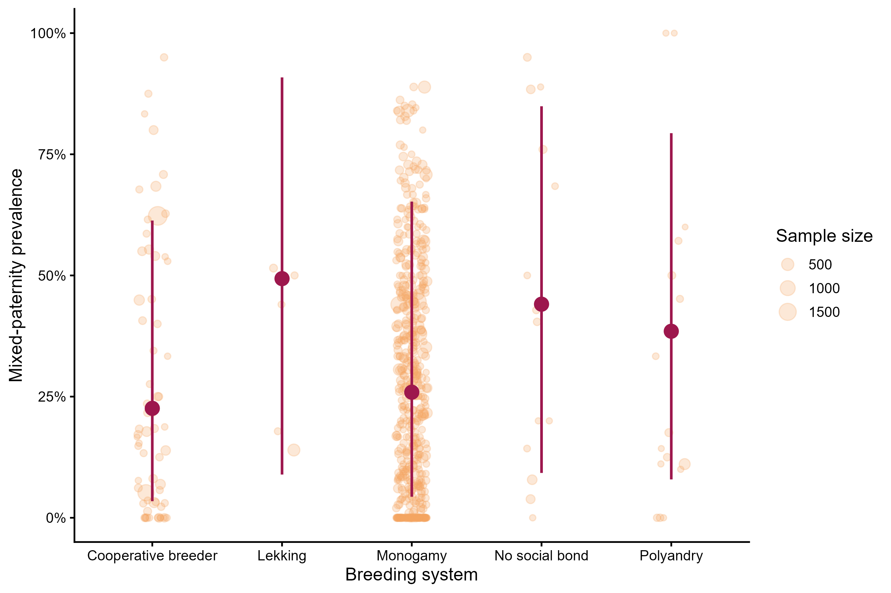
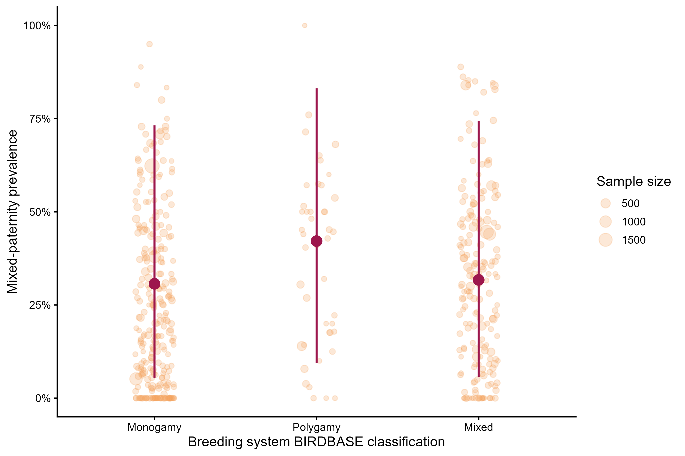
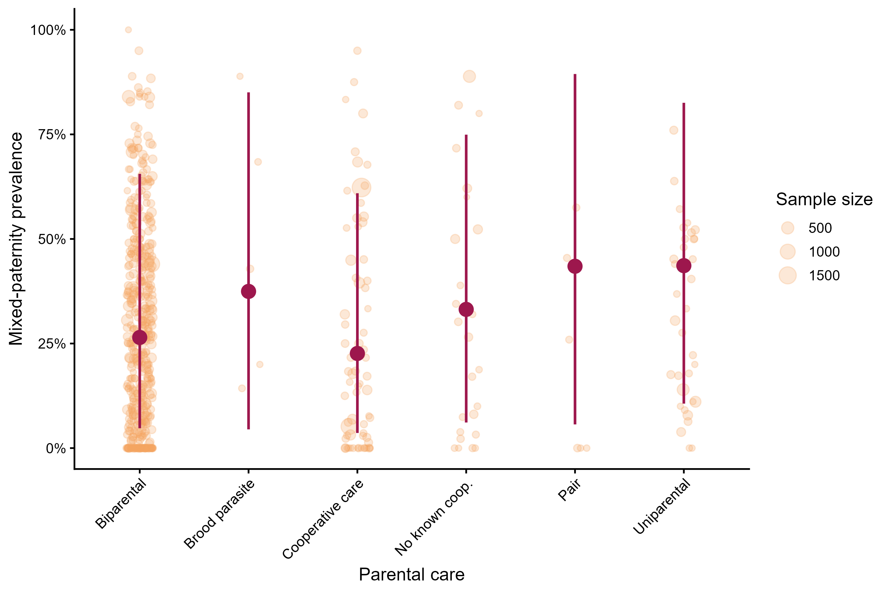
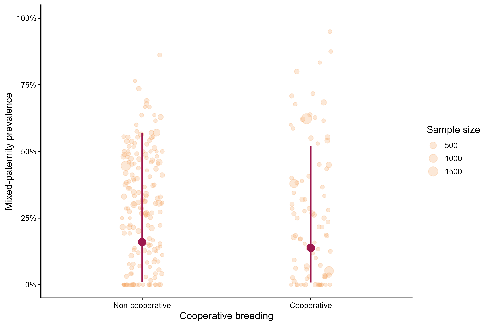

---
format:
  html:
    toc: true
    toc-depth: 3
---

:::: section-card
::: section-card
## Breeding system moderators

This section presents single-moderator models for variables describing avian breeding and parental systems, including the Brouwer and Griffith breeding-system classification, the BIRDBASE mono-/polygamy classification, parental-care system, and cooperative breeding.
:::
::::

```{r}

#| echo: false
#| message: false
#| warning: false

classification_sources <- tibble::tribble(
  ~Moderator, ~Classification_source, ~Notes,
  "Breeding system", "Brouwer and Griffith (2019)", "Rare categories with fewer than five observations were excluded.",
  "Mono-/polygamy", "BIRDBASE Şekercioğlu et al .2025", "A mixed category was created for records coded as both monogamous and polygamous.",
  "Parental care", "Cockburn (2006); Griesser et al. (2017)", "Used to represent variation in parental-care organisation.",
  "Cooperative breeding", "Co-BreeD Mocha et al. 2025", "Used to classify cooperative-breeding status."
)

knitr::kable(classification_sources)
```

## Packages

The R packages required for model fitting.

```{r}
#| label: setup
#| message: false
#| warning: false

library(tidyverse)
library(brms)
library(posterior)
library(bayesplot)
library(loo)
library(emmeans)

options(mc.cores = parallel::detectCores())
```

## Load prepared objects

```{r}

#| message: false
#| warning: false

data_overall_study <- readRDS("data/data_overall_study.rds")
phylo_mat <- readRDS("data/phylo_mat.rds")
```

```{r}
mixed_pat <- readRDS("data/mixed_pat_prepared.rds")
data_overall_study <- readRDS("data/data_overall_study.rds")

data_cooperative <- readRDS("data/data_cooperative.rds")
data_mono_poly <- readRDS("data/data_mono_poly.rds")
data_parental_care <- readRDS("data/data_parental_care.rds")
data_breeding_system <- readRDS("data/data_breeding_system.rds")

phylo_mat <- readRDS("data/phylo_mat.rds")
tree_analysis <- readRDS("data/tree_analysis.rds")
```

## Dataset sizes

```{r}
#| label: breeding-system-dataset-sizes
#| echo: false
#| message: false
#| warning: false

breeding_dataset_sizes <- tibble(
  Moderator = c(
    "Breeding system: Brouwer and Griffith",
    "Breeding system: BIRDBASE",
    "Parental care",
    "Cooperative breeding"
  ),
  Observations = c(
    nrow(data_breeding_system),
    nrow(data_mono_poly),
    nrow(data_parental_care),
    nrow(data_cooperative)
  )
)

knitr::kable(breeding_dataset_sizes)
```

## Model 

This helper function documents the shared model structure used for all single-moderator models. These models are fitted outside this website workflow and saved as `.rds` files.

```{r}
#| label: single-moderator-helper
#| eval: false
#| echo: true

fit_single_moderator <- function(formula, data) {
  brm(
    formula = formula,
    data = data,
    family = beta_binomial(link = "logit"),
    data2 = list(phylo_mat = phylo_mat),
    chains = 4,
    cores = 4,
    iter = 10000,
    warmup = 5000,
    control = list(
      adapt_delta = 0.99,
      max_treedepth = 15
    ),
    seed = 123
  )
}
```

## Breeding system: Brouwer and Griffith classification

This model tested whether mixed-paternity prevalence differed among breeding-system categories based on the Brouwer and Griffith classification. Rare categories with fewer than five observations were excluded before model fitting.

### Figure

```{r}

```

### Model summary

```{r}
#| label: breeding-system-model-summary
#| message: false
#| warning: false
#| code-fold: true

model_breeding_system_0 <- readRDS("models/model_breeding_system_0.rds")
summary(model_breeding_system_0)
```

### Prevalence table

```{r}
#| echo: false
#| message: false
#| warning: false

breeding_system_prevalence <- posterior_summary(model_breeding_system_0) %>%
  as.data.frame() %>%
  rownames_to_column("parameter") %>%
  filter(str_detect(parameter, "^b_breeding_system")) %>%
  mutate(
    breeding_system = str_remove(parameter, "b_breeding_system"),
    estimate_percent = plogis(Estimate) * 100,
    l95_percent = plogis(`Q2.5`) * 100,
    u95_percent = plogis(`Q97.5`) * 100
  ) %>%
  select(
    `Breeding-system category` = breeding_system,
    `Estimated prevalence (%)` = estimate_percent,
    `Lower 95% CrI` = l95_percent,
    `Upper 95% CrI` = u95_percent
  )

knitr::kable(breeding_system_prevalence, digits = 2)
```

### Post-hoc pairwise contrasts

Pairwise contrasts among breeding-system categories were calculated from the zero-intercept model. Estimates are reported on the logit scale.

```{r}
#| echo: false
#| message: false
#| warning: false

pairwise_breeding_system_0 <- readRDS("models/pairwise_breeding_system_0.rds")

breeding_posthoc <- as.data.frame(pairwise_breeding_system_0)

knitr::kable(breeding_posthoc, digits = 3)
```

## BIRDBASE breeding-system classification

This model tested whether mixed-paternity prevalence differed among monogamous, polygamous, and mixed mating-system categories derived from the BIRDBASE breeding-system classification. The mixed category was created during data preparation for cases in which both monogamous and polygamous classifications were simultaneously assigned in the original BIRDBASE coding.

### Figure

```{r}

```

### Model summary

```{r}
#| message: false
#| warning: false

model_mono_poly_0 <- readRDS("models/model_mono_poly_0.rds")
summary(model_mono_poly_0)
```

### Prevalence table

```{r}
#| echo: false
#| message: false
#| warning: false

mono_poly_prevalence <- posterior_summary(model_mono_poly_0) %>%
  as.data.frame() %>%
  rownames_to_column("parameter") %>%
  filter(str_detect(parameter, "^b_mono_poly_model")) %>%
  mutate(
    mono_poly_category = str_remove(parameter, "b_mono_poly_model"),
    estimate_percent = plogis(Estimate) * 100,
    l95_percent = plogis(`Q2.5`) * 100,
    u95_percent = plogis(`Q97.5`) * 100
  ) %>%
  select(
    `Mono-/polygamy category` = mono_poly_category,
    `Estimated prevalence (%)` = estimate_percent,
    `Lower 95% CrI` = l95_percent,
    `Upper 95% CrI` = u95_percent
  )

knitr::kable(mono_poly_prevalence, digits = 2)
```

### Post-hoc pairwise contrasts

Pairwise contrasts among breeding system categories were calculated from the zero-intercept model. Estimates are reported on the logit scale.

```{r}
#| echo: false
#| message: false
#| warning: false

pairwise_mono_poly_0 <- readRDS("models/pairwise_mono_poly_0.rds")

pairwise_mono_poly_table <- as.data.frame(pairwise_mono_poly_0)

knitr::kable(pairwise_mono_poly_table, digits = 3)
```

## Parental care

This model tested whether mixed-paternity prevalence differed among parental-care categories.

### Figure

```{r}

```

### Model summary

```{r}
#| message: false
#| warning: false
#| code-fold: true

model_parental_care_0 <- readRDS("models/model_parental_care_0.rds")
summary(model_parental_care_0)
```

### Prevalence table

Estimated mixed-paternity prevalence for each parental-care category was obtained from the zero-intercept model and back-transformed from the logit scale to percentages.

```{r}
#| echo: false
#| message: false
#| warning: false

parental_care_prevalence <- posterior_summary(model_parental_care_0) %>%
  as.data.frame() %>%
  rownames_to_column("parameter") %>%
  filter(str_detect(parameter, "^b_parental_care")) %>%
  mutate(
    parental_care = str_remove(parameter, "b_parental_care"),
    estimate_percent = plogis(Estimate) * 100,
    l95_percent = plogis(`Q2.5`) * 100,
    u95_percent = plogis(`Q97.5`) * 100
  ) %>%
  select(
    `Parental-care category` = parental_care,
    `Estimated prevalence (%)` = estimate_percent,
    `Lower 95% CrI` = l95_percent,
    `Upper 95% CrI` = u95_percent
  )

knitr::kable(parental_care_prevalence, digits = 2)
```

### Post-hoc pairwise contrasts

Pairwise contrasts among parental-care categories were calculated from the zero-intercept model. Estimates are reported on the logit scale.

```{r}

#| echo: false
#| message: false
#| warning: false

pairwise_parental_care_0 <- readRDS("models/pairwise_parental_care_0.rds")

parental_care_posthoc_table <- as.data.frame(pairwise_parental_care_0)

knitr::kable(parental_care_posthoc_table, digits = 3)
```

## Cooperative breeding

This model tested whether mixed-paternity prevalence differed between cooperative and non-cooperative breeding species. The intercept represents the reference category - non-cooperative breeders.

### Figure

```{r}

```

### Model-summary

```{r}
#| message: false
#| warning: false
#| code-fold: true

model_cooperative <- readRDS("models/model_cooperative.rds")
summary(model_cooperative)
```

###  Model estimates

```{r}
#| echo: false
#| message: false
#| warning: false

s_cooperative <- summary(model_cooperative)

cooperative_table <- tibble::tibble(
  Parameter = rownames(s_cooperative$fixed),
  Estimate = s_cooperative$fixed[, "Estimate"],
  `Lower 95% CrI` = s_cooperative$fixed[, "l-95% CI"],
  `Upper 95% CrI` = s_cooperative$fixed[, "u-95% CI"]
)

knitr::kable(cooperative_table, digits = 3)
```

## Heterogeneity summary

The table below compares residual heterogeneity across breeding-system, parental-care, and cooperative-breeding moderator models.

```{r}
#| label: breeding-system-heterogeneity-table
#| echo: false
#| message: false
#| warning: false

extract_heterogeneity <- function(model, model_name) {
  vc <- VarCorr(model)
  s <- summary(model)

  tibble::tibble(
    Model = model_name,
    `Study SD` = vc$Study_ID$sd[1, "Estimate"],
    `Non-phylogenetic species SD` = vc$species_nonphylo$sd[1, "Estimate"],
    `Phylogenetic species SD` = vc$species_phylo_brms$sd[1, "Estimate"],
    Phi = s$spec_pars["phi", "Estimate"]
  )
}

model_overall_study <- readRDS("models/model_overall_study.rds")

heterogeneity_breeding_table <- bind_rows(
  extract_heterogeneity(model_overall_study, "Overall model"),
  extract_heterogeneity(model_breeding_system_0, "Breeding system"),
  extract_heterogeneity(model_mono_poly_0, "Mono-/polygamy"),
  extract_heterogeneity(model_parental_care_0, "Parental care"),
  extract_heterogeneity(model_cooperative, "Cooperative breeding")
)

knitr::kable(heterogeneity_breeding_table, digits = 3)
```
