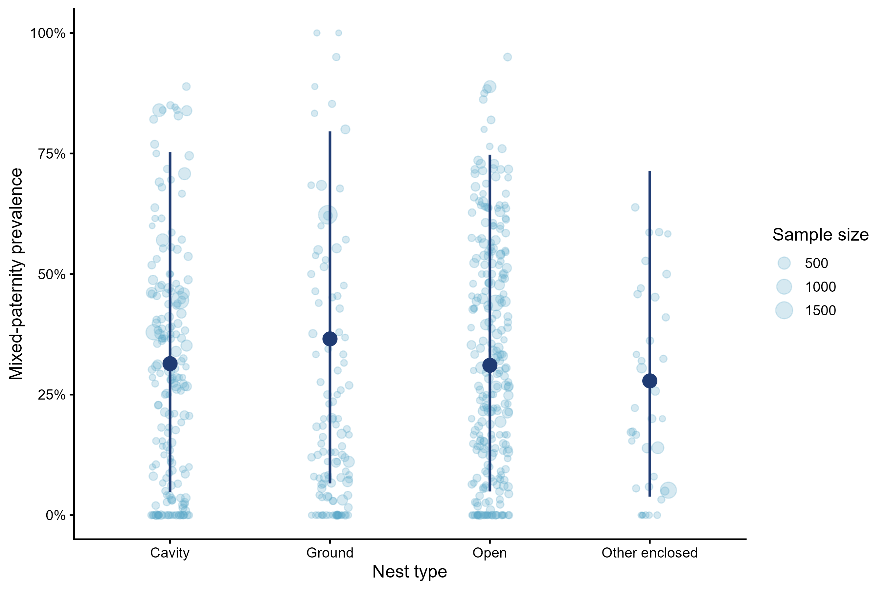
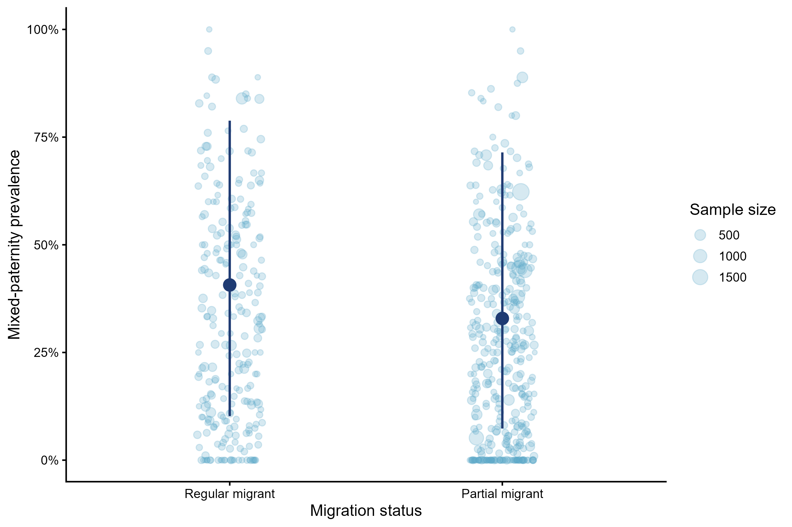
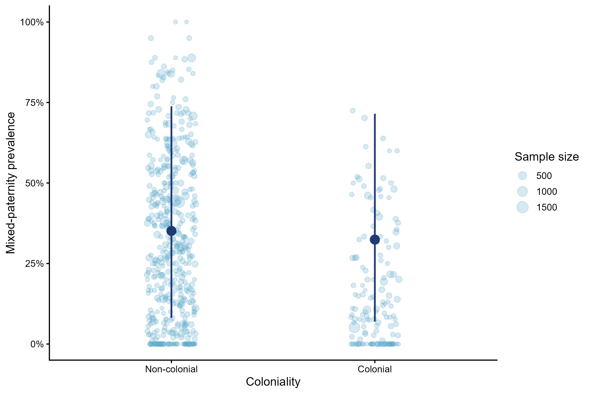
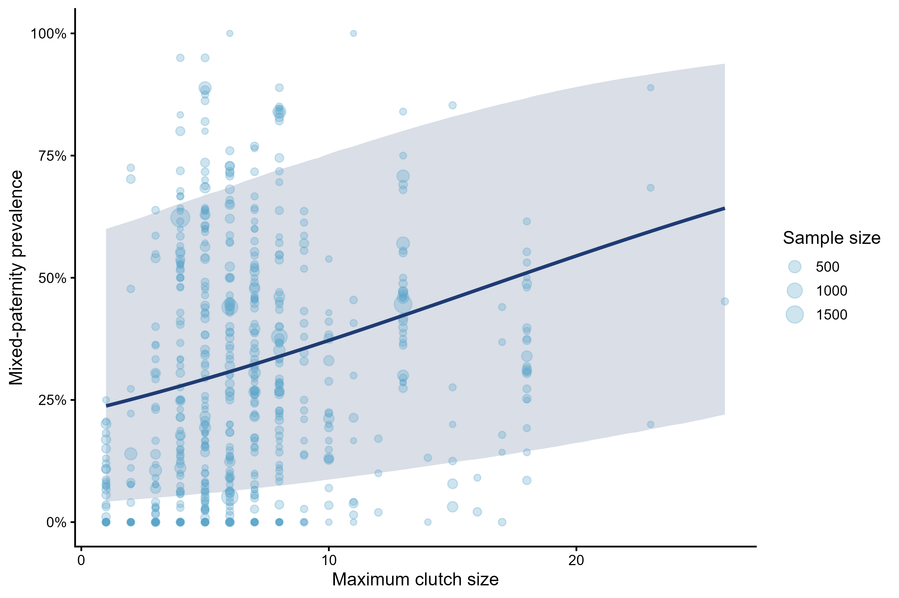
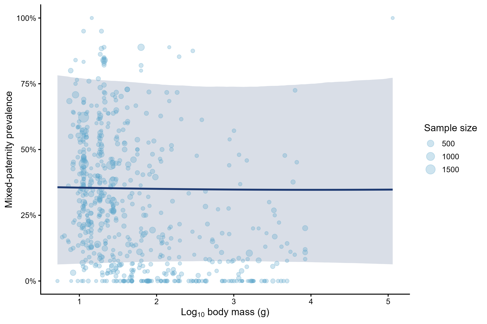
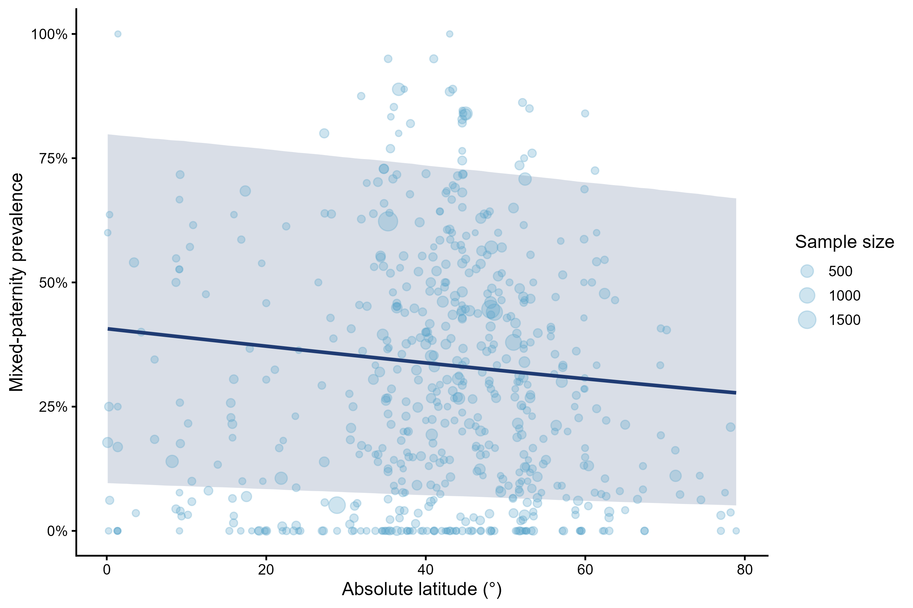

---
format:
  html:
    toc: true
    toc-depth: 3
---

::: section-card
## Biological moderators 

This section presents single-moderator models for ecological, life-history, and geographic predictors of brood-level mixed paternity. These models evaluate whether mixed-paternity prevalence varies with nest type, migration status, coloniality, clutch size, body mass, and absolute latitude, while retaining the same multilevel phylogenetic beta-binomial structure used in the overall model.
:::

## Packages

The R packages required for model fitting.

```{r}
#| label: setup
#| include: false

library(tidyverse)
library(brms)
library(posterior)
library(bayesplot)
library(loo)
library(ggplot2)

options(mc.cores = parallel::detectCores())
```

## Load prepared objects

```{r}
#| include: false

data_overall_study <- readRDS("data/data_overall_study.rds")
phylo_mat <- readRDS("data/phylo_mat.rds")
```

```{r}

mixed_pat <- readRDS("data/mixed_pat_prepared.rds")
data_overall_study <- readRDS("data/data_overall_study.rds")

data_abs_latitude <- readRDS("data/data_abs_latitude.rds")
data_body_mass <- readRDS("data/data_body_mass_log.rds")
data_clutch_size <- readRDS("data/data_clutch_size.rds")
data_coloniality <- readRDS("data/data_coloniality.rds")
data_migration <- readRDS("data/data_migration.rds")
data_nest_type <- readRDS("data/data_nest_type.rds")


phylo_mat <- readRDS("data/phylo_mat.rds")
tree_analysis <- readRDS("data/tree_analysis.rds")
```

### Dataset sizes

The table below shows the number of observations available for each biological moderator after removing missing values.

```{r}

#| label: bio-dataset-sizes
#| echo: false
#| message: false
#| warning: false

bio_dataset_sizes <- tibble::tibble(
  Moderator = c(
    "Nest type",
    "Migration",
    "Coloniality",
    "Maximum clutch size",
    "Body mass",
    "Absolute latitude"
  ),
  Observations = c(
    nrow(data_nest_type),
    nrow(data_migration),
    nrow(data_coloniality),
    nrow(data_clutch_size),
    nrow(data_body_mass),
    nrow(data_abs_latitude)
  )
)

knitr::kable(bio_dataset_sizes)
```

## Model 

This helper function documents the shared model structure used for all single-moderator models. These models are fitted outside this website workflow and saved as `.rds` files.

```{r}

#| eval: false
#| echo: true

fit_single_moderator <- function(formula, data) {
  brm(
    formula = formula,
    data = data,
    family = beta_binomial(link = "logit"),
    data2 = list(phylo_mat = phylo_mat),
    chains = 4,
    cores = 4,
    iter = 10000,
    warmup = 5000,
    control = list(
      adapt_delta = 0.99,
      max_treedepth = 15
    ),
    seed = 123
  )
}
```

## Nest type architecture

This model tested whether mixed-paternity prevalence differed among nest-type categories. Nest type was derived from BIRDBASE and simplified into four broad nest-architecture categories: cavity, ground, open, and other enclosed nests. Cavity nests included tree cavities and crevices; ground nests included burrows, scrapes, mounds, and nests placed directly on or in the ground; open nests included cups, saucers, platforms, and half-cups; and other enclosed nests included domes, pendant and globular nests, as well as nests built in other birds’ nests.

### Figure

```{r}

```

### Model summary

```{r}
#| message: false
#| warning: false
#| code-fold: true

model_nest_type <- readRDS("models/model_nest_type_0.rds")
summary(model_nest_type)
```

### Nest type model estimates

```{r}
#| echo: false
#| message: false
#| warning: false

nest_type_prevalence <- posterior_summary(model_nest_type) %>%
  as.data.frame() %>%
  rownames_to_column("parameter") %>%
  filter(str_detect(parameter, "^b_nest_type_model")) %>%
  mutate(
    nest_type = str_remove(parameter, "b_nest_type_model"),
    estimate_percent = plogis(Estimate) * 100,
    l95_percent = plogis(`Q2.5`) * 100,
    u95_percent = plogis(`Q97.5`) * 100
  ) %>%
  select(
    `Nest-type category` = nest_type,
    `Estimated prevalence (%)` = estimate_percent,
    `Lower 95% CrI` = l95_percent,
    `Upper 95% CrI` = u95_percent
  )

knitr::kable(nest_type_prevalence, digits = 2)
```

### Post-hoc pairwise contrasts

Pairwise contrasts among nest-type categories were calculated from the zero-intercept model. Estimates are reported on the logit scale.

```{r}
#| echo: false
#| message: false
#| warning: false

pairwise_nest_type_0 <- readRDS("models/pairwise_nest_type_0.rds")

nest_type_posthoc <- as.data.frame(pairwise_nest_type_0)

knitr::kable(nest_type_posthoc, digits = 3)
```

## Migration

This model tested whether mixed-paternity prevalence differed between strong and weak migrant categories. Migration status was analysed using two categories following BIRDBASE database: strong migrants and weak migrants. Here, strong migrants represent regular seasonal or long-distance migration, whereas weak migrants correspond to partial migration.

### Figure

```{r}

```

### Model summary

```{r}
#| label: migration-summary
#| message: false
#| warning: false
#| code-fold: true

model_migration <- readRDS("models/model_migration.rds")
summary(model_migration)
```

### Model estimates

The intercept represents the reference migration category, while the remaining coefficients describe differences relative to that reference category on the logit scale.

```{r}
#| label: migration-effect
#| echo: false
#| message: false
#| warning: false

s_migration <- summary(model_migration)

migration_table <- tibble::tibble(
  Parameter = rownames(s_migration$fixed),
  Estimate = s_migration$fixed[, "Estimate"],
  `Lower 95% CrI` = s_migration$fixed[, "l-95% CI"],
  `Upper 95% CrI` = s_migration$fixed[, "u-95% CI"]
)

knitr::kable(migration_table, digits = 3)
```

## Coloniality

This model tested whether mixed-paternity prevalence differed between colonial and non-colonial species following BIRDBASE database.

### Figures

```{r}

```

### Model summary

```{r}

#| message: false
#| warning: false
#| code-fold: true

model_coloniality <- readRDS("models/model_coloniality.rds")
summary(model_coloniality)


```

### Model estimates

```{r}
#| echo: false
#| message: false
#| warning: false

s_coloniality <- summary(model_coloniality)

coloniality_table <- tibble::tibble(
  Parameter = rownames(s_coloniality$fixed),
  Estimate = s_coloniality$fixed[, "Estimate"],
  `Lower 95% CrI` = s_coloniality$fixed[, "l-95% CI"],
  `Upper 95% CrI` = s_coloniality$fixed[, "u-95% CI"]
)

knitr::kable(coloniality_table, digits = 3)
```

## Clutch size

This model tested whether mixed-paternity prevalence was associated with maximum clutch size. Clutch size was scaled before model fitting, so the effect represents the change in log-odds of mixed paternity per one standard deviation increase in maximum clutch size.

### Figure

```{r}

```

### Model summary

```{r}
#| message: false
#| warning: false
#| code-fold: true

model_clutch_size <- readRDS("models/model_clutch_size.rds")
summary(model_clutch_size)
```

###  Model estimates

```{r}

#| echo: false
#| message: false
#| warning: false

s_clutch_size <- summary(model_clutch_size)

clutch_size_table <- tibble::tibble(
  Parameter = rownames(s_clutch_size$fixed),
  Estimate = s_clutch_size$fixed[, "Estimate"],
  `Lower 95% CrI` = s_clutch_size$fixed[, "l-95% CI"],
  `Upper 95% CrI` = s_clutch_size$fixed[, "u-95% CI"]
)

knitr::kable(clutch_size_table, digits = 3)
```

## Body mass

This model tested whether mixed-paternity prevalence was associated with adult body mass. Body mass was scaled before model fitting, so the effect represents the change in log-odds of mixed paternity per one standard deviation increase in body mass. Body mass was strongly right-skewed across species; therefore, body mass values were log10-transformed and standardised prior to analysis. Model coefficients thus represent the change in log-odds of mixed paternity associated with a one standard deviation increase in log-transformed body mass.

### Figure

```{r}

```

### Model summary

```{r}
#| message: false 
#| #| warning: false 
#| #| code-fold: true 

model_body_mass_log <- readRDS("models/model_log_body_mass.rds")
summary(model_body_mass_log)


```

### Model estimates

```{r}

#| echo: false
#| message: false
#| warning: false

s_body_mass <- summary(model_body_mass_log)

body_mass_table <- tibble::tibble(
  Parameter = rownames(s_body_mass$fixed),
  Estimate = s_body_mass$fixed[, "Estimate"],
  `Lower 95% CrI` = s_body_mass$fixed[, "l-95% CI"],
  `Upper 95% CrI` = s_body_mass$fixed[, "u-95% CI"]
)

knitr::kable(body_mass_table, digits = 3)

```

## Absolute latitude

This model tested whether mixed-paternity prevalence varied with absolute latitude. Absolute latitude was used to examine broad geographic patterns independent of hemisphere, with larger values corresponding to populations located farther from the equator. Absolute latitude was scaled before model fitting, so the effect represents the change in log-odds of mixed paternity per one standard deviation increase in absolute latitude.

### Figure

```{r}

```

### Model  summary

```{r}
#| message: false 
#| #| warning: false 
#| #| code-fold: true 

model_abs_latitude <- readRDS("models/model_abs_latitude.rds") 
summary(model_abs_latitude) 

```

### Model estimates

```{r}
#| echo: false
#| message: false
#| warning: false

s_abs_latitude <- summary(model_abs_latitude)


abs_latitude_table <- tibble::tibble(
  Parameter = rownames(s_abs_latitude$fixed),
  Estimate = s_abs_latitude$fixed[, "Estimate"],
  `Lower 95% CrI` = s_abs_latitude$fixed[, "l-95% CI"],
  `Upper 95% CrI` = s_abs_latitude$fixed[, "u-95% CI"]
)

knitr::kable(abs_latitude_table, digits = 3)
```

## Heterogeneity summary

```{r}
#| echo: false
#| message: false
#| warning: false

extract_heterogeneity <- function(model, model_name) {
  vc <- VarCorr(model)
  s <- summary(model)

  tibble::tibble(
    Model = model_name,
    `Study SD` = vc$Study_ID$sd[1, "Estimate"],
    `Non-phylogenetic species SD` = vc$species_nonphylo$sd[1, "Estimate"],
    `Phylogenetic species SD` = vc$species_phylo_brms$sd[1, "Estimate"],
    Phi = s$spec_pars["phi", "Estimate"]
  )
}

model_overall_study <- readRDS("models/model_overall_study.rds")

heterogeneity_bio_table <- bind_rows(
  extract_heterogeneity(model_overall_study, "Overall model"),
  extract_heterogeneity(model_nest_type, "Nest type"),
  extract_heterogeneity(model_migration, "Migration"),
  extract_heterogeneity(model_coloniality, "Coloniality"),
  extract_heterogeneity(model_clutch_size, "Clutch size"),
  extract_heterogeneity(model_body_mass_log, "Body mass"),
  extract_heterogeneity(model_abs_latitude, "Absolute latitude")
)

knitr::kable(heterogeneity_bio_table, digits = 3)
```
