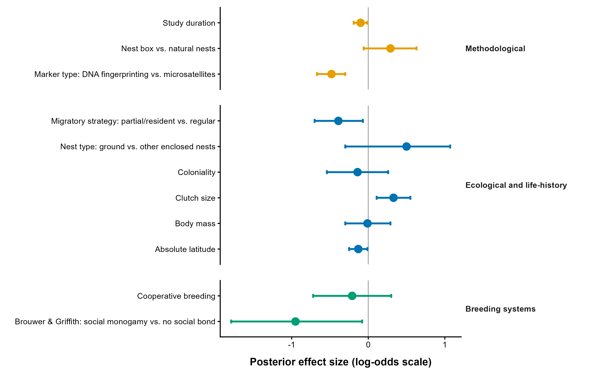
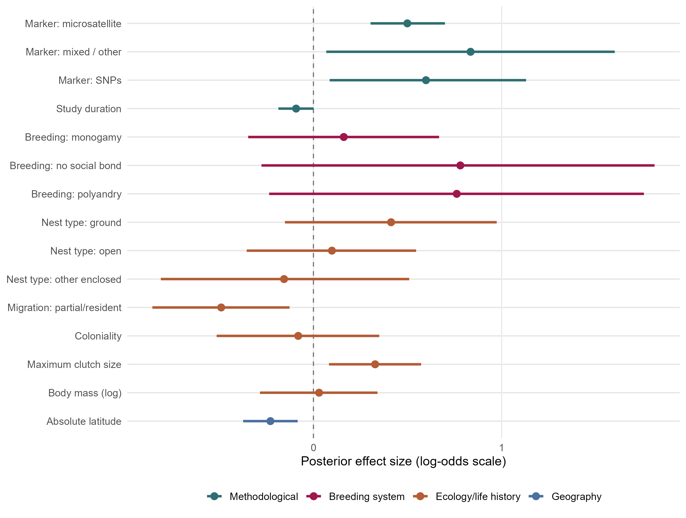

---
format:
  html:
    toc: true
    toc-depth: 3
---

::: section-card
## Figures

This section presents the main reproducible figures generated for the mixed-paternity meta-analysis, including phylogenetic, geographic, methodological, biological, and breeding-system moderator plots. Figures combine observed study-level prevalence with posterior predictions from the fitted phylogenetic beta-binomial models.
:::

## Packages

```{r}
#| message: false
#| warning: false

library(tidyverse)
library(ape)

library(brms)
library(posterior)
library(bayesplot)
library(loo)
library(tidybayes)

library(patchwork)
library(maps)

library(ggtree)
library(ggtreeExtra)
library(ggnewscale)
library(viridis)

# for plotting/export helpers
library(scales)
library(grid)

options(mc.cores = parallel::detectCores())
```

## Data import

### Load data

```{r}
mixed_pat <- readRDS("data/mixed_pat_prepared.rds")
data_overall_study <- readRDS("data/data_overall_study.rds")

data_abs_latitude <- readRDS("data/data_abs_latitude.rds")
data_body_mass <- readRDS("data/data_body_mass_log.rds")
data_clutch_size <- readRDS("data/data_clutch_size.rds")
data_coloniality <- readRDS("data/data_coloniality.rds")
data_cooperative <- readRDS("data/data_cooperative.rds")
data_marker_type <- readRDS("data/data_marker_type.rds")
data_migration <- readRDS("data/data_migration.rds")
data_mono_poly <- readRDS("data/data_mono_poly.rds")
data_nest_box <- readRDS("data/data_nest_box.rds")
data_nest_type <- readRDS("data/data_nest_type.rds")
data_parental_care <- readRDS("data/data_parental_care.rds")
data_study_duration <- readRDS("data/data_study_duration.rds")
data_breeding_system <- readRDS("data/data_breeding_system.rds")

phylo_mat <- readRDS("data/phylo_mat.rds")
tree_analysis <- readRDS("data/tree_analysis.rds")
```

### Load models

```{r}
model_overall_study <- readRDS("models/model_overall_study.rds")
model_nest_type <- readRDS("models/model_nest_type_0.rds")
model_migration <- readRDS("models/model_migration.rds")
model_coloniality <- readRDS("models/model_coloniality.rds")
model_breeding_system_0 <- readRDS("models/model_breeding_system_0.rds")
model_mono_poly_0 <- readRDS("models/model_mono_poly_0.rds")
model_parental_care_0 <- readRDS("models/model_parental_care_0.rds")
model_cooperative <- readRDS("models/model_cooperative.rds")
model_marker_type_0 <- readRDS("models/model_marker_type_0.rds")
model_nest_box <- readRDS("models/model_nest_box.rds")
```

The four continuous-moderator figures below use the common-scaling refits stored in `models/common_scaling/`. Their plotting script is `scripts/generate_common_scaling_figures.R`; the rendered files are included here so that this chapter does not refit the Bayesian models.

## Phylogeny plot

```{r}
final_analysis_species <- data_overall_study %>%
  filter(!is.na(species_phylo_brms)) %>%
  distinct(species = as.character(species_phylo_brms)) %>%
  pull(species)

# The prepared tree contains 393 taxa, whereas the final overall model contains
# 375 species. The 18 omitted taxa have neither mixed-brood counts nor brood
# denominators and therefore are not part of the final analytical dataset.
excluded_nonanalytical_tips <- setdiff(
  tree_analysis$tip.label,
  final_analysis_species
)
tree_figure <- ape::keep.tip(
  tree_analysis,
  final_analysis_species
)

stopifnot(
  length(tree_analysis$tip.label) == 393,
  length(excluded_nonanalytical_tips) == 18,
  length(tree_figure$tip.label) == 375,
  setequal(tree_figure$tip.label, final_analysis_species)
)

species_annotations <- tibble(species = tree_figure$tip.label) %>%
  left_join(
    data_overall_study %>%
      mutate(species = as.character(species_phylo_brms)) %>%
      group_by(species) %>%
      summarise(
        mixed_broods = if_else(
          all(is.na(n_mixed_broods)), NA_real_,
          sum(n_mixed_broods, na.rm = TRUE)
        ),
        total_broods = if_else(
          all(is.na(n_total_broods)), NA_real_,
          sum(n_total_broods, na.rm = TRUE)
        ),
        n_studies_species = n_distinct(Study_ID[!is.na(Study_ID)]),
        migration_model = dplyr::first(
          na.omit(as.character(migration)), default = NA_character_
        ),
        maximum_clutch_size = dplyr::first(
          na.omit(as.numeric(CS_max)), default = NA_real_
        ),
        .groups = "drop"
      ),
    by = "species"
  ) %>%
  mutate(
    mixed_paternity_prevalence = if_else(
      !is.na(total_broods) & total_broods > 0,
      mixed_broods / total_broods,
      NA_real_
    ),
    sampling_support = if_else(
      !is.na(total_broods), log10(total_broods + 1), NA_real_
    ),
    migration = factor(
      dplyr::recode(
        migration_model,
        Strong = "Regular migrant",
        Weak = "Resident / weak or irregular movement"
      ),
      levels = c("Regular migrant", "Resident / weak or irregular movement")
    )
  )

stopifnot(
  nrow(species_annotations) == length(tree_figure$tip.label),
  !anyDuplicated(species_annotations$species),
  setequal(species_annotations$species, tree_figure$tip.label),
  all(
    dplyr::between(species_annotations$mixed_paternity_prevalence, 0, 1)
  ),
  !anyNA(species_annotations$total_broods),
  all(species_annotations$total_broods > 0),
  all(species_annotations$n_studies_species >= 0)
)

dir.create("tables", showWarnings = FALSE)
readr::write_csv(
  species_annotations %>%
    select(
      species, mixed_broods, total_broods, n_studies_species,
      mixed_paternity_prevalence, sampling_support,
      migration, maximum_clutch_size
    ),
  "tables/phylogeny_species_annotations.csv"
)
readr::write_csv(
  tibble(
    species = excluded_nonanalytical_tips,
    reason = paste(
      "Absent from final overall-model dataset:",
      "no mixed-brood count or brood denominator"
    )
  ),
  "tables/phylogeny_excluded_nonanalytical_tips.csv"
)

stopifnot(
  identical(species_annotations$species, tree_figure$tip.label)
)
```

```{r}
#| fig-cap: "Descriptive phylogenetic visualisation of the 375 species included in the final overall meta-analytic model. Radial-bar colour shows pooled observed mixed-paternity prevalence (total mixed-paternity broods divided by total broods sampled). Radial-bar height shows sampling support using log10(total broods + 1); the support key below the tree uses exactly the same transformation and reports the original brood counts. The outer categorical ring shows migratory status using the two analytical categories; missing values are grey. All species-level tracks are descriptive observations, not phylogenetically adjusted model predictions."
#| fig-width: 7.087
#| fig-height: 5.669

p_tree_base <- ggtree(
  tree_figure,
  layout = "circular",
  linewidth = 0.18,
  colour = "grey72"
) +
  ggtreeExtra::geom_fruit(
    data = species_annotations,
    geom = geom_col,
    mapping = aes(
      y = species,
      x = sampling_support,
      fill = mixed_paternity_prevalence
    ),
    offset = 0.035,
    pwidth = 0.20,
    width = 0.92
  ) +
  scale_fill_gradientn(
    colours = viridisLite::magma(
      256, begin = 0.12, end = 0.90, direction = -1
    ),
    name = "Pooled observed\nmixed-paternity prevalence",
    limits = c(0, 1),
    breaks = c(0, 0.25, 0.50, 0.75, 1),
    labels = scales::label_percent(accuracy = 1),
    na.value = "grey82",
    guide = "none"
  ) +
  ggnewscale::new_scale_fill() +
  ggtreeExtra::geom_fruit(
    data = species_annotations,
    geom = geom_tile,
    mapping = aes(y = species, x = 1, fill = migration),
    offset = 0.020,
    pwidth = 0.075
  ) +
  scale_fill_manual(
    name = "Migratory status",
    values = c(
      "Regular migrant" = "#0072B2",
      "Resident / weak or irregular movement" = "#E69F00"
    ),
    na.value = "grey82",
    drop = FALSE,
    guide = "none"
  ) +
  theme_void() +
  theme(
    legend.position = "none",
    plot.margin = margin(2, 4, -88, 4, unit = "pt")
  )

# Explicit keys keep all three scales aligned in one row below the tree.
legend_family <- "sans"
legend_title_size <- 9.5
legend_label_size <- 8.5

prevalence_key_data <- tibble(
  prevalence = seq(0, 1, length.out = 256),
  y = 1
)

p_prevalence_key <- ggplot(
  prevalence_key_data,
  aes(x = prevalence, y = y, fill = prevalence)
) +
  geom_tile(height = 0.18) +
  scale_fill_gradientn(
    colours = viridisLite::magma(
      256, begin = 0.12, end = 0.90, direction = -1
    ),
    limits = c(0, 1),
    guide = "none"
  ) +
  scale_x_continuous(
    breaks = c(0, 0.25, 0.50, 0.75, 1),
    labels = scales::label_percent(accuracy = 1),
    expand = c(0, 0)
  ) +
  labs(
    title = "Pooled observed\nmixed-paternity prevalence",
    x = NULL,
    y = NULL
  ) +
  coord_cartesian(ylim = c(0.68, 1.32), clip = "off") +
  theme_classic(base_size = legend_label_size, base_family = legend_family) +
  theme(
    axis.line = element_blank(),
    axis.ticks.y = element_blank(),
    axis.text.y = element_blank(),
    axis.text.x = element_text(
      family = legend_family, size = legend_label_size,
      margin = margin(t = 1)
    ),
    plot.title = element_text(
      family = legend_family, face = "bold", size = legend_title_size,
      hjust = 0, margin = margin(b = 2)
    ),
    plot.margin = margin(0, 2, 9, 2)
  )

migration_key_data <- tibble(
  label = c("regular migrant", "Partial/resident"),
  colour = c("#0072B2", "#E69F00"),
  y = c(0.70, 0.30)
)

p_migration_key <- ggplot(migration_key_data) +
  geom_tile(
    aes(x = 0, y = y, fill = colour),
    width = 0.065,
    height = 0.15
  ) +
  geom_text(
    aes(x = 0.055, y = y, label = label),
    hjust = 0,
    family = legend_family,
    size = legend_label_size / ggplot2::.pt
  ) +
  scale_fill_identity() +
  scale_x_continuous(limits = c(-0.07, 0.68), expand = c(0, 0)) +
  scale_y_continuous(limits = c(0, 1), expand = c(0, 0)) +
  labs(title = "Migratory status\n") +
  theme_void(base_size = legend_label_size, base_family = legend_family) +
  theme(
    plot.title = element_text(
      family = legend_family, face = "bold", size = legend_title_size,
      hjust = 0, margin = margin(b = 2)
    ),
    plot.margin = margin(0, 2, 9, 2)
  )

# The key uses the same log10(total broods + 1) transformation as the radial
# bars. Dividing by the observed maximum preserves exactly the relative bar
# heights shown in the tree; labels remain on the original brood-count scale.
support_max_broods <- max(species_annotations$total_broods, na.rm = TRUE)
support_breaks <- c(10, 100, 1000)
support_breaks <- support_breaks[
  support_breaks >= min(species_annotations$total_broods, na.rm = TRUE) &
    support_breaks <= support_max_broods
]

p_support_key <- tibble(
  total_broods = support_breaks,
  support = log10(total_broods + 1),
  relative_height = support /
    max(species_annotations$sampling_support, na.rm = TRUE),
  label = scales::comma(total_broods),
  key_x = seq(1.15, by = 0.35, length.out = length(support_breaks))
) %>%
  ggplot(aes(x = key_x, y = relative_height)) +
  geom_col(width = 0.13, fill = "grey42") +
  geom_text(
    aes(y = -0.11, label = label),
    family = legend_family,
    size = legend_label_size / ggplot2::.pt,
    vjust = 0.5
  ) +
  scale_x_continuous(limits = c(0.50, 2.50), expand = c(0, 0)) +
  scale_y_continuous(limits = c(-0.24, 1.05), expand = c(0, 0)) +
  labs(
    title = "Total broods sampled\n",
    x = NULL,
    y = NULL
  ) +
  theme_void(base_size = legend_label_size, base_family = legend_family) +
  theme(
    plot.title = element_text(
      family = legend_family, face = "bold", size = legend_title_size,
      hjust = 0, margin = margin(b = 2)
    ),
    plot.margin = margin(0, 2, 9, 2)
  )

p_bottom_keys <- patchwork::plot_spacer() |
  p_prevalence_key | p_migration_key | p_support_key |
  patchwork::plot_spacer()
p_bottom_keys <- p_bottom_keys +
  patchwork::plot_layout(widths = c(0.12, 1.05, 0.64, 0.74, 0.12))

p_bottom_keys_wrapped <- patchwork::wrap_elements(full = p_bottom_keys)

p_tree_final <- p_tree_base / p_bottom_keys_wrapped +
  # At the 144-mm final height, allocate exactly 36 mm to the legend row,
  # matching the standalone 180-mm legend proof exported below.
  patchwork::plot_layout(heights = c(108, 36))

dir.create("Figures", showWarnings = FALSE)
tryCatch(
  ggsave(
    "Figures/phylogeny_figure.pdf",
    p_tree_final,
    width = 180,
    height = 144,
    units = "mm",
    device = cairo_pdf
  ),
  error = function(e) message(
    "The PDF export could not be refreshed (for example because the file is open); ",
    "the figure is still rendered below and the PNG export is retained."
  )
)
ggsave(
  "Figures/phylogeny_figure.png",
  p_tree_final,
  width = 180,
  height = 144,
  units = "mm",
  dpi = 300,
  bg = "white"
)
ggsave(
  "Figures/phylogeny_legend_180mm.png",
  p_bottom_keys,
  width = 180,
  height = 36,
  units = "mm",
  dpi = 300,
  bg = "white"
)

p_tree_final
```

The source tree contains 393 taxa, but the figure is restricted to the 375
species represented in the final overall-model dataset. The 18 excluded tips
have neither mixed-brood counts nor brood denominators and therefore have no
observed prevalence for the final meta-analysis. Pruning is applied only to the
descriptive figure; the stored source tree and all analytical objects are
unchanged.

## Geographic distribution of study populations

```{r}
world_map <- map_data("world")

map_data_points <- mixed_pat %>%
  # Exclude records without a valid brood denominator before aggregation;
  # this prevents na.rm = TRUE from silently creating invalid prevalence values.
  filter(
    !is.na(Lat_round),
    !is.na(Long_round),
    !is.na(n_mixed_broods),
    !is.na(n_non_mixed_broods),
    !is.na(n_total_broods),
    n_total_broods > 0
  ) %>%
  group_by(Lat_round, Long_round) %>%
  summarise(
    n_studies = n_distinct(Study_ID),
    mixed_broods = sum(n_mixed_broods),
    total_broods = sum(n_total_broods),
    mixed_paternity = mixed_broods / total_broods,
    .groups = "drop"
  )

stopifnot(
  all(map_data_points$total_broods > 0),
  all(is.finite(map_data_points$mixed_paternity)),
  all(dplyr::between(map_data_points$mixed_paternity, 0, 1))
)

dir.create("tables", showWarnings = FALSE)
readr::write_csv(
  map_data_points,
  "tables/geographic_distribution_plotting_data.csv"
)

map_validation <- tibble(
  check = c(
    "Unique plotted coordinates",
    "Minimum number of studies",
    "Maximum number of studies",
    "Minimum pooled prevalence",
    "Maximum pooled prevalence",
    "Geocoded records with missing or invalid brood denominator",
    "Geocoded records with a zero brood denominator",
    "Plotted prevalence values outside 0-1",
    "Pooled mixed-brood total",
    "Pooled total-brood denominator"
  ),
  value = c(
    nrow(map_data_points),
    min(map_data_points$n_studies),
    max(map_data_points$n_studies),
    min(map_data_points$mixed_paternity),
    max(map_data_points$mixed_paternity),
    sum(
      !is.na(mixed_pat$Lat_round) & !is.na(mixed_pat$Long_round) &
        (is.na(mixed_pat$n_total_broods) | mixed_pat$n_total_broods <= 0)
    ),
    sum(
      !is.na(mixed_pat$Lat_round) & !is.na(mixed_pat$Long_round) &
        !is.na(mixed_pat$n_total_broods) & mixed_pat$n_total_broods == 0
    ),
    sum(!dplyr::between(map_data_points$mixed_paternity, 0, 1)),
    sum(map_data_points$mixed_broods),
    sum(map_data_points$total_broods)
  )
)

knitr::kable(map_validation, caption = "Validation of geographic map data")
```

```{r}
#| fig-cap: "Global geographic distribution of studies included in the comparative meta-analysis of avian mixed paternity. Point size indicates the number of distinct studies associated with each rounded geographic coordinate, and point colour indicates pooled observed mixed-paternity prevalence, calculated as the total number of mixed-paternity broods divided by the total number of broods sampled at that location."

p_map <- ggplot() +
  geom_polygon(
    data = world_map,
    aes(x = long, y = lat, group = group),
    fill = "grey90",
    colour = "white",
    linewidth = 0.2
  ) +
  geom_point(
    data = map_data_points,
    aes(
      x = Long_round,
      y = Lat_round,
      size = n_studies,
      colour = mixed_paternity
    ),
    alpha = 0.78
  ) +
  coord_quickmap() +
  scale_size_continuous(
    name = "Number of studies",
    range = c(1.7, 8),
    breaks = c(1, 3, 5, 8, 11)
  ) +
  scale_colour_viridis_c(
    name = "Observed mixed-paternity\nprevalence",
    option = "viridis",
    limits = c(0, 1),
    labels = scales::label_percent(accuracy = 1)
  ) +
  theme_minimal() +
  labs(
    x = "Longitude",
    y = "Latitude"
  ) +
  guides(
    size = guide_legend(order = 1),
    colour = guide_colourbar(order = 2, barheight = grid::unit(35, "mm"))
  ) +
  theme(
    legend.position = "right",
    legend.box = "vertical",
    legend.box.spacing = grid::unit(3, "mm")
  )

dir.create("figures", showWarnings = FALSE)

ggsave(
  "figures/geographic_distribution_mixed_paternity.pdf",
  plot = p_map,
  width = 9,
  height = 5.5,
  units = "in",
  device = cairo_pdf
)
p_map
```

## Figure preparation

Points represent observed brood-level mixed-paternity prevalence across study populations, scaled by sample size. Dark points and vertical intervals represent posterior predicted prevalence and 95% credible intervals from the fitted beta-binomial phylogenetic model.

```{r}
#| echo: false
#| message: false
#| warning: false
#| fig-width: 10
#| fig-height: 5
#| fig-cap: "Observed mixed-paternity prevalence across study populations and the estimated overall prevalence from the intercept-only model."

plot_data <- data_overall_study %>%
  mutate(
    observed_prev = 100 * n_mixed_broods / n_total_broods,
    sample_size = n_total_broods
  )

overall_est <- plogis(
  fixef(model_overall_study)["Intercept", "Estimate"]
) * 100


p_overall_prevalence <- ggplot(plot_data, aes(x = observed_prev, y = 0)) +
  geom_jitter(
    aes(size = sample_size),
    height = 0.12,
    alpha = 0.35,
    color = "#5AA6C8"
  ) +
  geom_vline(
    xintercept = overall_est,
    linetype = "dashed",
    linewidth = 0.9,
    color = "#244b5a"
  ) +
  geom_point(
    aes(x = overall_est, y = 0),
    size = 6,
    shape = 21,
    fill = "#244b5a",
    color = "white",
    stroke = 1.5
  ) +
  annotate(
    "text",
    x = overall_est + 6,
    y = 0.18,
    label = paste0("Overall prevalence: ", round(overall_est, 1), "%"),
    hjust = 0,
    size = 5
  ) +
  scale_x_continuous(
    limits = c(0, 100),
    breaks = seq(0, 100, 25),
    labels = function(x) paste0(x, "%")
  ) +
  scale_size_continuous(
    name = "Sample size",
    range = c(1.5, 7)
  ) +
  labs(
    x = "Observed mixed-paternity prevalence",
    y = NULL
  ) +
  theme_minimal(base_size = 15) +
  theme(
    axis.text.y = element_blank(),
    axis.ticks.y = element_blank(),
    panel.grid.major.y = element_blank(),
    panel.grid.minor = element_blank(),
    legend.position = "right")
  
p_overall_prevalence
```

```{r}
plot_categorical_moderator <- function(data, model, cat_var, x_lab, labels = NULL) {
  
  pred_data <- data %>%
    distinct(.data[[cat_var]]) %>%
    rename(category = .data[[cat_var]]) %>%
    mutate(n_total_broods = 1)
  
  names(pred_data)[names(pred_data) == "category"] <- cat_var
  
  pred <- pred_data %>%
    tidybayes::add_epred_draws(model, re_formula = NA) %>%
    tidybayes::mean_qi(.epred)
  
  plot_data <- data %>%
    mutate(
      observed_prev = n_mixed_broods / n_total_broods
    )
  
  if (!is.null(labels)) {
    pred[[cat_var]] <- factor(pred[[cat_var]], levels = names(labels), labels = labels)
    plot_data[[cat_var]] <- factor(plot_data[[cat_var]], levels = names(labels), labels = labels)
  }
  
  ggplot() +
    geom_jitter(
      data = plot_data,
      aes(
        x = .data[[cat_var]],
        y = observed_prev,
        size = n_total_broods
      ),
      width = 0.12,
      alpha = 0.25,
      colour = "#5AA6C8"
    ) +
    geom_pointrange(
      data = pred,
      aes(
        x = .data[[cat_var]],
        y = .epred,
        ymin = .lower,
        ymax = .upper
      ),
      colour = "#1F3B73",
      linewidth = 0.9,
      size = 0.9
    ) +
    scale_y_continuous(
  labels = scales::percent_format(accuracy = 1)
) +
coord_cartesian(ylim = c(0, 1)) +
    scale_size_continuous(
      name = "Sample size",
      range = c(1.5, 6)
    ) +
    labs(
      x = x_lab,
      y = "Mixed-paternity prevalence"
    ) +
    theme_classic(base_size = 13)
}
```

```{r}
#| label: plot-continuous-moderator-function
#| message: false
#| warning: false

plot_continuous_moderator <- function(data, model, raw_var, sc_var, x_lab) {
  
  mean_x <- mean(data[[raw_var]], na.rm = TRUE)
  sd_x <- sd(data[[raw_var]], na.rm = TRUE)
  
  pred_data <- tibble(
    x_raw = seq(
      min(data[[raw_var]], na.rm = TRUE),
      max(data[[raw_var]], na.rm = TRUE),
      length.out = 100
    )
  ) %>%
    mutate(
      !!sc_var := (x_raw - mean_x) / sd_x,
      n_total_broods = 1
    )
  
  pred <- pred_data %>%
    tidybayes::add_epred_draws(model, re_formula = NA) %>%
    tidybayes::mean_qi(.epred)
  
  ggplot() +
    geom_ribbon(
      data = pred,
      aes(x = x_raw, ymin = .lower, ymax = .upper),
      fill = "#2C4A7A",
      alpha = 0.18
    ) +
    geom_point(
      data = data,
      aes(
        x = .data[[raw_var]],
        y = n_mixed_broods / n_total_broods,
        size = n_total_broods
      ),
      colour = "#5AA6C8",
      alpha = 0.30
    ) +
    geom_line(
      data = pred,
      aes(x = x_raw, y = .epred),
      colour = "#1F3B73",
      linewidth = 1.2
    ) +
    scale_y_continuous(
      labels = scales::percent_format(accuracy = 1)
    ) +
    coord_cartesian(ylim = c(0, 1)) +
    scale_size_continuous(
      name = "Sample size",
      range = c(1.5, 6)
    ) +
    labs(
      x = x_lab,
      y = "Mixed-paternity prevalence"
    ) +
    theme_classic(base_size = 13)
}
```

## Figures for methodological moderators

```{r}
#| label: fig-marker-type
#| fig-cap: "Predicted mixed-paternity prevalence across marker types."
p_marker_type <- plot_categorical_moderator(
  data_marker_type,
  model_marker_type_0,
  cat_var = "marker_type_model",
  x_lab = "Marker type",
  labels = c(
    "DNA_fingerprinting" = "DNA fingerprinting",
    "microsatellite" = "Microsatellite",
    "mixed_other" = "Mixed / other",
    "SNPs" = "SNPs"
  )
)

p_marker_type
```

```{r}
#| label: fig-nest-box
#| fig-cap: "Predicted mixed-paternity prevalence in natural nests and in nest-boxs studies."
p_nest_box <- plot_categorical_moderator(
  data_nest_box,
  model_nest_box,
  cat_var = "nest_box_model",
  x_lab = "Nest-box use",
  labels = c(
    "no" = "Natural nests",
    "yes" = "Nest boxes"
  )
)
p_nest_box
```

```{r}
#| label: fig-study-duration
#| fig-cap: "Population-level predicted mixed-paternity prevalence across study duration from the common-scaling refit. Study duration was standardised using the overall analytical dataset; points show observed record-level prevalence and the ribbon shows the 95% credible interval."

knitr::include_graphics("Figures/common_scaling/study_duration.png")
```

## Figures for biological moderator

```{r}
#| label: fig-abs-latitude
#| fig-cap: "Population-level predicted mixed-paternity prevalence across absolute latitude from the common-scaling refit. Absolute latitude was standardised using the overall analytical dataset; points show observed record-level prevalence and the ribbon shows the 95% credible interval."

knitr::include_graphics("Figures/common_scaling/abs_latitude.png")
```

```{r}
#| label: fig-clutch-size
#| fig-cap: "Population-level predicted mixed-paternity prevalence across maximum clutch size from the common-scaling refit. Maximum clutch size was standardised using the overall analytical dataset; points show observed record-level prevalence and the ribbon shows the 95% credible interval."

knitr::include_graphics("Figures/common_scaling/clutch_size.png")
```

```{r}
#| label: fig-body-mass
#| fig-cap: "Population-level predicted mixed-paternity prevalence across log10 adult body mass from the common-scaling refit. Log10 body mass was standardised using the overall analytical dataset; points show observed record-level prevalence and the ribbon shows the 95% credible interval."

knitr::include_graphics("Figures/common_scaling/body_mass.png")
```

```{r}
#| label: fig-migration
#| fig-cap: "Predicted mixed-paternity prevalence across migration categories."
p_migration <- plot_categorical_moderator(
  data_migration,
  model_migration,
  cat_var = "migration",
  x_lab = "Migration status",
  labels = c(
    "Strong" = "Regular migrant",
    "Weak" = "Partial migrant"
  )
)
p_migration
```

```{r}
#| label: fig-coloniality
#| fig-cap: "Predicted mixed-paternity prevalence across coloniality categories."

p_coloniality <- plot_categorical_moderator(
  data_coloniality,
  model_coloniality,
  cat_var = "coloniality",
  x_lab = "Coloniality",
  labels = c(
    "0" = "Non-colonial",
    "1" = "Colonial"
  )
)
p_coloniality

```

```{r}
#| label: fig-nest-type
#| fig-cap: "Predicted mixed-paternity prevalence across nest types."

data_nest_type <- data_overall_study %>%
  filter(!is.na(nest_type_model)) %>%
  mutate(
    nest_type_model = factor(
      as.character(nest_type_model),
      levels = c("cavity", "ground", "open", "other_enclosed", "zero__")
    )
  ) %>%
  droplevels()

p_nest_type <- plot_categorical_moderator(
  data_nest_type,
  model_nest_type,
  cat_var = "nest_type_model",
  x_lab = "Nest type"
) +
  scale_x_discrete(
    labels = c(
      "cavity" = "Cavity",
      "ground" = "Ground",
      "open" = "Open",
      "other_enclosed" = "Other enclosed",
      "zero__" = "Zero"
    )
  )

p_nest_type
```

## Figures for breeding/parental system modeartaors figures

```{r}
plot_social_moderator <- function(data, model, cat_var, x_lab, labels = NULL) {
  
  pred_data <- data %>%
    distinct(.data[[cat_var]]) %>%
    rename(category = .data[[cat_var]]) %>%
    mutate(n_total_broods = 1)
  
  names(pred_data)[names(pred_data) == "category"] <- cat_var
  
  pred <- pred_data %>%
    tidybayes::add_epred_draws(model, re_formula = NA) %>%
    tidybayes::mean_qi(.epred)
  
  plot_data <- data %>%
    mutate(observed_prev = n_mixed_broods / n_total_broods)
  
  if (!is.null(labels)) {
    pred[[cat_var]] <- factor(pred[[cat_var]], levels = names(labels), labels = labels)
    plot_data[[cat_var]] <- factor(plot_data[[cat_var]], levels = names(labels), labels = labels)
  }
  
  ggplot() +
    geom_jitter(
      data = plot_data,
      aes(x = .data[[cat_var]], y = observed_prev, size = n_total_broods),
      width = 0.12,
      alpha = 0.25,
      colour = "#F4A261"
    ) +
    geom_pointrange(
      data = pred,
      aes(x = .data[[cat_var]], y = .epred, ymin = .lower, ymax = .upper),
      colour = "#9D174D",
      linewidth = 0.9,
      size = 0.9
    ) +
    scale_y_continuous(
  labels = scales::percent_format(accuracy = 1)
) +
coord_cartesian(ylim = c(0, 1)) +
    scale_size_continuous(
      name = "Sample size",
      range = c(1.5, 6)
    ) +
    labs(
      x = x_lab,
      y = "Mixed-paternity prevalence"
    ) +
    theme_classic(base_size = 13)
}

```

```{r}
#| label: fig-breeding-system
#| fig-cap: "Predicted mixed-paternity prevalence across breeding-system categories."


data_breeding_system <- readRDS("data/data_breeding_system.rds") %>%
  mutate(
    breeding_system = factor(
      breeding_system,
      levels = c(
        "cooperative_breeder",
        "lekking",
        "monogamy",
        "no_social_bond",
        "polyandry"
      )
    )
  )

p_breeding_system <- plot_social_moderator(
  data = data_breeding_system,
  model = model_breeding_system_0,
  cat_var = "breeding_system",
  x_lab = "Breeding system",
  labels = c(
    "cooperative_breeder" = "Cooperative breeder",
    "lekking" = "Lekking",
    "monogamy" = "Monogamy",
    "no_social_bond" = "No social bond",
    "polyandry" = "Polyandry"
  )
)

p_breeding_system
```

```{r}
#| label: fig-mono-poly
#| fig-cap: "Predicted mixed-paternity prevalence across mono-/polygamy categories."

p_mono_poly <- plot_social_moderator(
  data_mono_poly,
  model_mono_poly_0,
  cat_var = "mono_poly_model",
  x_lab = "Breeding system BIRDBASE classification",
  labels = c(
    "monogamy" = "Monogamy",
    "polygamy" = "Polygamy",
    "mixed" = "Mixed"
  )
)
p_mono_poly
```

```{r}
#| label: fig-parental-care
#| fig-cap: "Predicted mixed-paternity prevalence across parental-care categories."
p_parental_care <- plot_social_moderator(
  data_parental_care,
  model_parental_care_0,
  cat_var = "parental_care",
  x_lab = "Parental care",
  labels = c(
    "biparental" = "Biparental",
    "broodparasite" = "Brood parasite",
    "cooperation" = "Cooperative care",
    "nk_cooperation" = "No known coop.",
    "pair" = "Pair",
    "uniparental" = "Uniparental"
  )
) +
  theme(
    axis.text.x = element_text(angle = 45, hjust = 1, vjust = 1)
  )
p_parental_care 
```

```{r}
#| label: fig-cooperative-breeding
#| fig-cap: "Predicted mixed-paternity prevalence across cooperative-breeding categories."

p_cooperative <- plot_social_moderator(
  data_cooperative,
  model_cooperative,
  cat_var = "cooperative_breeding",
  x_lab = "Cooperative breeding",
  labels = c(
    "no" = "Non-cooperative",
    "yes" = "Cooperative"
  )
)

p_cooperative
```

## Forest plots

### Single-moderator models

```{r}
#| echo: true
#| eval: false
#| message: false
#| warning: false
#| code-fold: true
#| code-summary: "Code"

forest_dat_unchanged <- tibble::tribble(
  ~group, ~moderator, ~estimate, ~lower, ~upper,
  "Methodological", "Nest box vs. natural nests", 0.29, -0.06, 0.63,
  "Methodological", "Marker type: DNA fingerprinting vs. microsatellites", -0.48, -0.67, -0.30,
  "Ecological and life-history", "Migratory strategy: partial/resident vs. regular", -0.39, -0.70, -0.07,
  "Ecological and life-history", "Nest type: ground vs. other enclosed nests", 0.50, -0.30, 1.07,
  "Ecological and life-history", "Coloniality", -0.14, -0.54, 0.26,
  "Breeding systems", "Cooperative breeding", -0.21, -0.72, 0.30,
  "Breeding systems", "Brouwer & Griffith: social monogamy vs. no social bond", -0.95, -1.79, -0.08
)

read_common_scaling_effect <- function(path, term, group, moderator) {
  readr::read_csv(path, show_col_types = FALSE) |>
    dplyr::filter(.data$term == .env$term) |>
    dplyr::transmute(
      group = .env$group,
      moderator = .env$moderator,
      estimate = .data$Estimate,
      lower = .data$Q2.5,
      upper = .data$Q97.5
    )
}

forest_dat_refitted <- dplyr::bind_rows(
  read_common_scaling_effect(
    "tables/common_scaling/model_study_duration_fixed_effects.csv",
    "study_duration_sc", "Methodological", "Study duration"
  ),
  read_common_scaling_effect(
    "tables/common_scaling/model_clutch_size_fixed_effects.csv",
    "CS_max_sc", "Ecological and life-history", "Clutch size"
  ),
  read_common_scaling_effect(
    "tables/common_scaling/model_log_body_mass_fixed_effects.csv",
    "log_body_mass_sc", "Ecological and life-history", "Body mass"
  ),
  read_common_scaling_effect(
    "tables/common_scaling/model_abs_latitude_fixed_effects.csv",
    "abs_lat_sc", "Ecological and life-history", "Absolute latitude"
  )
)

forest_dat <- dplyr::bind_rows(forest_dat_unchanged, forest_dat_refitted)

forest_dat <- forest_dat %>%
  dplyr::mutate(
    group = factor(group, levels = c("Methodological", "Ecological and life-history", "Breeding systems")),
    moderator = factor(moderator, levels = rev(moderator))
  )

p_forest_main <- ggplot2::ggplot(forest_dat, ggplot2::aes(x = estimate, y = moderator, color = group)) +
  ggplot2::geom_vline(xintercept = 0, linewidth = 0.5, color = "grey60") +
  ggplot2::geom_errorbarh(ggplot2::aes(xmin = lower, xmax = upper), height = 0.15, linewidth = 1.2) +
  ggplot2::geom_point(size = 4.5) +
  ggplot2::facet_grid(group ~ ., scales = "free_y", space = "free_y") +
  ggplot2::scale_color_manual(values = c(
    "Methodological" = "#E69F00",
    "Ecological and life-history" = "#0072B2",
    "Breeding systems" = "#009E73"
  )) +
  ggplot2::labs(x = "Posterior effect size (log-odds scale)", y = NULL) +
  ggplot2::theme_classic(base_size = 14) +
  ggplot2::theme(
    strip.background = ggplot2::element_blank(),
    strip.text.y = ggplot2::element_text(face = "bold", angle = 0, hjust = 0, size = 11),
    axis.text.y = ggplot2::element_text(size = 11, color = "black"),
    axis.text.x = ggplot2::element_text(color = "black"),
    axis.title.x = ggplot2::element_text(margin = ggplot2::margin(t = 12), face = "bold"),
    legend.position = "none",
    panel.spacing = grid::unit(1.5, "lines"),
    plot.margin = ggplot2::margin(10, 25, 10, 20)
  )

dir.create("Figures/common_scaling", recursive = TRUE, showWarnings = FALSE)
ggplot2::ggsave(
  "Figures/common_scaling/Forest_plot8.pdf", p_forest_main,
  width = 14, height = 8.6, units = "in"
)
ggplot2::ggsave(
  "Figures/common_scaling/Forest_plot8.png", p_forest_main,
  width = 14, height = 8.6, units = "in", dpi = 300
)

```

```{r}
#| label: fig-forest-plot
#| fig-cap: "Posterior mean effects and 95% equal-tailed credible intervals from the single-moderator models. Continuous predictors are expressed per one standard deviation using the common scaling derived from the overall analytical dataset; categorical effects are contrasts relative to their stated reference categories."
#| echo: false
#| out-width: "100%"


```

### Full multivariable model

The primary multivariable model included 533 records from 481 study identities and 326 species. Continuous predictors are expressed per one standard deviation using the common scaling constants. Categorical coefficients are contrasts relative to DNA fingerprinting, cooperative breeding, cavity nesting, regular migration, and non-coloniality.

#### Exact coefficient table

```{r}
#| label: tbl-full-model-fixed-effects
#| echo: true
#| message: false
#| warning: false
#| code-fold: true
#| code-summary: "Code"

full_model_table_labels <- c(
  Intercept = "Intercept",
  marker_type_modelmicrosatellite = "Marker: microsatellite",
  marker_type_modelmixed_other = "Marker: mixed / other",
  marker_type_modelSNPs = "Marker: SNPs",
  study_duration_sc = "Study duration (1 SD)",
  breeding_systemmonogamy = "Breeding: monogamy",
  breeding_systemno_social_bond = "Breeding: no social bond",
  breeding_systempolyandry = "Breeding: polyandry",
  nest_type_modelground = "Nest type: ground",
  nest_type_modelopen = "Nest type: open",
  nest_type_modelother_enclosed = "Nest type: other enclosed",
  migrationWeak = "Migration: partial/resident",
  coloniality1 = "Coloniality: colonial",
  CS_max_sc = "Maximum clutch size (1 SD)",
  log_body_mass_sc = "Body mass, log10 (1 SD)",
  abs_lat_sc = "Absolute latitude (1 SD)"
)

full_model_coefficients <- readr::read_csv(
  "tables/common_scaling/model_full_brouwer_griffith_fixed_effects.csv",
  show_col_types = FALSE
) |>
  dplyr::transmute(
    Predictor = dplyr::recode(term, !!!full_model_table_labels, .default = term),
    Estimate = Estimate,
    SE = Est.Error,
    `Lower 95% CrI` = Q2.5,
    `Upper 95% CrI` = Q97.5,
    OR = exp(Estimate),
    `Lower 95% OR` = exp(Q2.5),
    `Upper 95% OR` = exp(Q97.5)
  )

knitr::kable(
  full_model_coefficients,
  digits = 3,
  caption = "Posterior mean fixed effects, posterior standard errors, 95% equal-tailed credible intervals, and odds-ratio transformations from the primary multivariable phylogenetic beta-binomial model."
)
```

```{r}
#| echo: true
#| eval: false
#| message: false
#| warning: false
#| code-fold: true
#| code-summary: "Code"

full_model_path <- c(
  "models/model_full_BG.rds",
  "models/model_full_brouwer_griffith.rds"
) |>
  purrr::keep(file.exists) |>
  dplyr::first(default = NA_character_)

stopifnot(!is.na(full_model_path))
model_full_brouwer_griffith <- readRDS(full_model_path)

full_fixef <- as.data.frame(brms::fixef(model_full_brouwer_griffith)) |>
  tibble::rownames_to_column("term") |>
  dplyr::filter(term != "Intercept")

lower_name <- intersect(c("Q2.5", "l-95% CI"), names(full_fixef))[1]
upper_name <- intersect(c("Q97.5", "u-95% CI"), names(full_fixef))[1]

full_effect_labels <- c(
  marker_type_modelmicrosatellite = "Marker: microsatellite",
  marker_type_modelmixed_other = "Marker: mixed / other",
  marker_type_modelSNPs = "Marker: SNPs",
  study_duration_sc = "Study duration",
  breeding_systemmonogamy = "Breeding: monogamy",
  breeding_systemno_social_bond = "Breeding: no social bond",
  breeding_systempolyandry = "Breeding: polyandry",
  nest_type_modelground = "Nest type: ground",
  nest_type_modelopen = "Nest type: open",
  nest_type_modelother_enclosed = "Nest type: other enclosed",
  migrationWeak = "Migration: partial/resident",
  coloniality1 = "Coloniality",
  CS_max_sc = "Maximum clutch size",
  log_body_mass_sc = "Body mass (log)",
  abs_lat_sc = "Absolute latitude"
)

full_effect_groups <- c(
  marker_type_modelmicrosatellite = "Methodological",
  marker_type_modelmixed_other = "Methodological",
  marker_type_modelSNPs = "Methodological",
  study_duration_sc = "Methodological",
  breeding_systemmonogamy = "Breeding system",
  breeding_systemno_social_bond = "Breeding system",
  breeding_systempolyandry = "Breeding system",
  nest_type_modelground = "Ecology/life history",
  nest_type_modelopen = "Ecology/life history",
  nest_type_modelother_enclosed = "Ecology/life history",
  migrationWeak = "Ecology/life history",
  coloniality1 = "Ecology/life history",
  CS_max_sc = "Ecology/life history",
  log_body_mass_sc = "Ecology/life history",
  abs_lat_sc = "Geography"
)

forest_data_full <- full_fixef |>
  dplyr::transmute(
    predictor = dplyr::recode(term, !!!full_effect_labels, .default = term),
    group = dplyr::recode(term, !!!full_effect_groups, .default = "Other"),
    estimate = Estimate,
    lower = .data[[lower_name]],
    upper = .data[[upper_name]]
  ) |>
  dplyr::mutate(
    group = factor(
      group,
      levels = c("Methodological", "Breeding system", "Ecology/life history", "Geography", "Other")
    ),
    predictor = factor(predictor, levels = rev(predictor))
  )

p_full_model_forest <- ggplot2::ggplot(
  forest_data_full,
  ggplot2::aes(x = estimate, y = predictor, colour = group)
) +
  ggplot2::geom_vline(
    xintercept = 0, linetype = "dashed", linewidth = 0.5, colour = "grey45"
  ) +
  ggplot2::geom_errorbarh(
    ggplot2::aes(xmin = lower, xmax = upper), height = 0, linewidth = 1.1
  ) +
  ggplot2::geom_point(size = 2.8) +
  ggplot2::scale_colour_manual(values = c(
    "Methodological" = "#2f6f73",
    "Breeding system" = "#9D174D",
    "Ecology/life history" = "#b35c35",
    "Geography" = "#4b6f9e",
    "Other" = "grey40"
  )) +
  ggplot2::labs(
    x = "Posterior effect size (log-odds scale)", y = NULL, colour = NULL
  ) +
  ggplot2::theme_minimal(base_size = 12) +
  ggplot2::theme(
    panel.grid.minor = ggplot2::element_blank(),
    panel.grid.major.y = ggplot2::element_line(colour = "grey90"),
    legend.position = "bottom"
  )

dir.create("Figures/model_diagnostics", recursive = TRUE, showWarnings = FALSE)
ggplot2::ggsave(
  "Figures/model_diagnostics/full_model_fixed_effects_forest_plot.png",
  p_full_model_forest, width = 9, height = 6.8, dpi = 300
)
ggplot2::ggsave(
  "Figures/model_diagnostics/full_model_fixed_effects_forest_plot.pdf",
  p_full_model_forest, width = 9, height = 6.8, device = "pdf"
)
```

```{r}
#| label: fig-full-model-forest-plot
#| fig-cap: "Posterior mean fixed effects and 95% equal-tailed credible intervals from the full multivariable phylogenetic beta-binomial model. Continuous predictors are expressed per one standard deviation using the common scaling derived from the overall analytical dataset; categorical coefficients are contrasts relative to the model reference levels."
#| echo: false
#| out-width: "100%"


```
